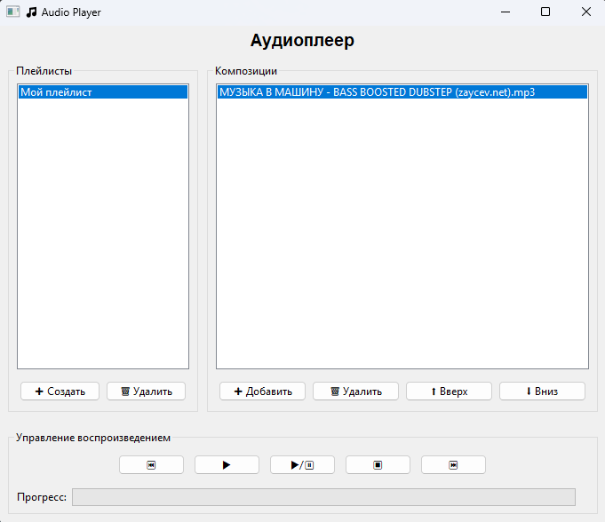

# 🎵 Audio Player

Простой аудиоплеер на Python с поддержкой плейлистов, воспроизведения, паузы и перемотки.

**Технологии:**

* Python 3.10+
* wxPython 4.2.4 (GUI)
* pygame 2.6.1 (воспроизведение аудио)
* simplejson 3.20.2 (сохранение плейлистов)

---

## ⚙️ Функционал

* создание плейлиста;
* удаление плейлиста;
* добавление музыкальной композиции в плейлист;
* удаление музыкальной композиции из плейлиста;
* перемещение музыкальной композиции на другую позицию плейлисте (изменение порядка);
* проигрывание музыкальной композиции;
* запуск предыдущей музыкальной композиции;
* запуск последующей музыкальной композиции;
* после завершения проигрывания последней композиции в плейлисте он начинается сначала.

---

## 🗂 Структура проекта

```
AudioPlayer/
│
├─ AudioPlayer.py               # Главный скрипт
├─ main/                 # Пакет с модулями
│   ├─ __init__.py
│   ├─ composition.py
│   ├─ linked_list.py
│   ├─ PlayerController.py
│   ├─ Playlist.py
│   ├─ PlaylistJSONController.py
│   └─ UI.py
└─ playlists/            # JSON плейлисты
```

---

## 🛠 Установка

1. Клонируйте репозиторий:

```bash
git clone https://github.com/NB2612/audioplayer.git
cd audioplayer
```

2. Создайте виртуальное окружение (рекомендуется):

```bash
python -m venv .venv
source .venv/bin/activate   # Linux/macOS
.venv\Scripts\activate      # Windows
```

3. Установите зависимости:

```bash
pip install -r requirements.txt
```

> **requirements.txt**:
>
> ```
> wxPython==4.2.4
> pygame==2.6.1
> simplejson==3.20.2
> ```

---

## 🖥 Запуск программы

Из корня проекта выполните:

```bash
python AudioPlayer.py
```

---

## 📦 Компиляция в exe (Windows)

Используем PyInstaller:

1. Установите PyInstaller:

```bash
pip install pyinstaller
```

2. Соберите exe:

```bash
pyinstaller --onefile --windowed main.py --icon=myicon.ico
```

* `--onefile` — собирает один exe
* `--windowed` — отключает консоль
* `--icon` — иконка программы (опционально)

3. После сборки exe появится в папке `dist/`:

```
dist/AudioPlayer.exe
```

---

## 📚 Документация классов

### 1. `Composition`

Представляет музыкальную композицию.

**Методы:**

* `get_path()` → `str` — путь к аудиофайлу.
* `get_title()` → `str` — название трека.
* `get_duration()` → `float` — длительность трека.
* Поддержка `==` для сравнения с другой композицией, строкой или числом.

---

### 2. `LinkedList` / `LinkedListItem`

Кольцевой двусвязный список для хранения объектов.

**Методы:**

* `append_left(item)` — добавить элемент в начало.
* `append_right(item)` / `append(item)` — добавить элемент в конец.
* `remove(item)` — удалить элемент.
* `insert(previous, item)` — вставить после указанного элемента.
* `__len__()` — размер списка.
* Итераторы: `__iter__()` и `__reversed__()`.

---

### 3. `PlayList` (наследник `LinkedList`)

Плейлист с текущей композицией.

**Методы:**

* `add_song(composition)` — добавить композицию.
* `remove_song(composition)` — удалить композицию.
* `next_song()` / `previous_song()` — переключение треков.
* `get_current()` — текущий трек.
* `move_up(composition)` / `move_down(composition)` — перемещение треков.
* `find_node(data)` — найти узел.
* `get_all_songs()` — получить список всех треков.

---

### 4. `PlaylistJSONController`

Контроллер сохранения/загрузки плейлистов в JSON.

**Методы:**

* `save_playlist(name, playlist)` — сохранить плейлист.
* `delete_playlist_file(name)` — удалить файл плейлиста.
* `load_playlists()` → `dict[str, PlayList]` — загрузить все плейлисты.
* `playlist_file(name)` → `str` — путь к JSON-файлу.
* `ensure_dir()` — создать папку для плейлистов, если не существует.

---

### 5. `AudioPlayerFrame`

GUI аудиоплеера с wxPython.

**Основные элементы:**

* Панель плейлистов и композиций.
* Кнопки управления: `▶`, `⏸`, `⏹`, `⏮`, `⏭`.
* Прогресс бар воспроизведения.

**Методы интеграции:**

* `on_add_playlist(event)` / `on_delete_playlist(event)`
* `on_select_playlist(event)`
* `refresh_composition_list()`
* `on_add_composition(event)` / `on_delete_composition(event)`
* `on_move_up(event)` / `on_move_down(event)`
* `on_play(event)` / `on_pause(event)` / `on_stop(event)`
* `on_prev(event)` / `on_next(event)`
* `update_progress(event)` — обновление прогресса трека.

---

## ⚡ Примечания

* Поддерживаются аудиофайлы `.mp3` и `.wav`.
* Плейлисты автоматически сохраняются в папку `playlists/`.
* Для корректной работы GUI требуется wxPython 4.x.

---

## 📷 Скриншот интерфейса

---

## 👨‍💻 Автор

Николай Балакирев

Программа разработана для учебного проекта по курсу Алгоритмы и структуры данных.
